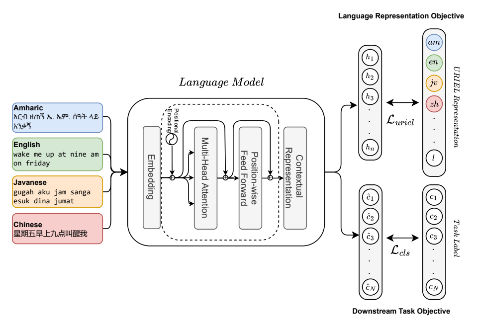
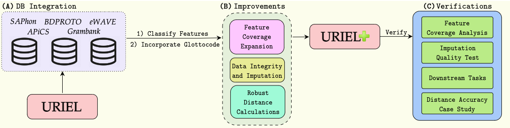

# Using LinguAlchemy Method with URIEL+

By [Mason Shipton](https://github.com/Masonshipton25), [David Anugraha](https://github.com/davidanugraha), [York Hay Ng](https://github.com/Swithord)

## Contents

- [About LinguAlchemy](#about-lingualchemy)
- [About URIEL+](#about-uriel)
- [Environment](#environment)
- [Running LinguAlchemy Method](#running-lingualchemy-method)
  - [1. Vector Creation](#1-vector-creation)
  - [2. Running Experiments](#2-running-experiments)

  Optional

  - [3. Determining Statistical Significance](#3-determining-statistical-significance)

## About LinguAlchemy

### [LinguAlchemy: Fusing Typological and Geographical Elements for Unseen Language Generalization](https://aclanthology.org/2024.findings-emnlp.225/)



#### Abstract

Pretrained language models (PLMs) have become remarkably adept at task and language generalization. Nonetheless, they often fail when faced with unseen languages. In this work, we present LinguAlchemy, a regularization method that incorporates various linguistic information covering typological, geographical, and phylogenetic features to align PLMs representation to the corresponding linguistic information on each language. Our LinguAlchemy significantly improves the performance of mBERT and XLM-R on low-resource languages in multiple downstream tasks such as intent classification, news classification, and semantic relatedness compared to fully finetuned models and displaying a high degree of unseen language generalization. We further introduce AlchemyScale and AlchemyTune, extension of LinguAlchemywhich adjusts the linguistic regularization weights automatically, alleviating the need for hyperparameter search. 

If you are interested for more information, check out the [full paper](https://aclanthology.org/2024.findings-emnlp.225/).

<u>If you use this code for your research, please cite the following work:</u>

```bibtex
@inproceedings{adilazuarda-etal-2024-lingualchemy,
    title = "{L}ingu{A}lchemy: Fusing Typological and Geographical Elements for Unseen Language Generalization",
    author = "Adilazuarda, Muhammad Farid  and
      Cahyawijaya, Samuel  and
      Winata, Genta Indra  and
      Purwarianti, Ayu  and
      Aji, Alham Fikri",
    editor = "Al-Onaizan, Yaser  and
      Bansal, Mohit  and
      Chen, Yun-Nung",
    booktitle = "Findings of the Association for Computational Linguistics: EMNLP 2024",
    month = nov,
    year = "2024",
    address = "Miami, Florida, USA",
    publisher = "Association for Computational Linguistics",
    url = "https://aclanthology.org/2024.findings-emnlp.225/",
    doi = "10.18653/v1/2024.findings-emnlp.225",
    pages = "3912--3928",
    abstract = "Pretrained language models (PLMs) have shown remarkable generalization toward multiple tasks and languages. Nonetheless, the generalization of PLMs towards unseen languages is poor, resulting in significantly worse language performance, or even generating nonsensical responses that are comparable to a random baseline. This limitation has been a longstanding problem of PLMs raising the problem of diversity and equal access to language modeling technology. In this work, we solve this limitation by introducing LinguAlchemy, a regularization technique that incorporates various aspects of languages covering typological, geographical, and phylogenetic constraining the resulting representation of PLMs to better characterize the corresponding linguistics constraints. LinguAlchemy significantly improves the accuracy performance of mBERT and XLM-R on unseen languages by {\textasciitilde}18{\%} and {\textasciitilde}2{\%}, respectively compared to fully finetuned models and displaying a high degree of unseen language generalization. We further introduce AlchemyScale and AlchemyTune, extension of LinguAlchemy which adjusts the linguistic regularization weights automatically, alleviating the need for hyperparameter search. LinguAlchemy enables better cross-lingual generalization to unseen languages which is vital for better inclusivity and accessibility of PLMs."
}
```

If you have any questions, you can open a [GitHub Issue](https://github.com/faridlazuarda/LinguAlchemy/issues).


## About URIEL+

### [URIEL+: Enhancing Linguistic Inclusion and Usability in a Typological and Multilingual Knowledge Base](https://aclanthology.org/2025.coling-main.463/)



#### Abstract
URIEL is a knowledge base offering geographical, phylogenetic, and typological vector representations for 7970 languages. It includes distance measures between these vectors for 4005 languages, which are accessible via the lang2vec tool. Despite being frequently cited, URIEL is limited in terms of linguistic inclusion and overall usability. To tackle these challenges, we introduce URIEL+, an enhanced version of URIEL and lang2vec addressing these limitations. In addition to expanding typological feature coverage for 2898 languages, URIEL+ improves user experience with robust, customizable distance calculations to better suit the needs of the users. These upgrades also offer competitive performance on downstream tasks and provide distances that better align with linguistic distance studies.

If you are interested for more information, check out the [full paper](https://aclanthology.org/2025.coling-main.463/).

<u>If you use this code for your research, please cite the following work:</u>

```bibtex
@inproceedings{khan-etal-2025-uriel,
    title = "{URIEL}+: Enhancing Linguistic Inclusion and Usability in a Typological and Multilingual Knowledge Base",
    author = {Khan, Aditya  and
      Shipton, Mason  and
      Anugraha, David  and
      Duan, Kaiyao  and
      Hoang, Phuong H.  and
      Khiu, Eric  and
      Do{\u{g}}ru{\"o}z, A. Seza  and
      Lee, En-Shiun Annie},
    editor = "Rambow, Owen  and
      Wanner, Leo  and
      Apidianaki, Marianna  and
      Al-Khalifa, Hend  and
      Eugenio, Barbara Di  and
      Schockaert, Steven",
    booktitle = "Proceedings of the 31st International Conference on Computational Linguistics",
    month = jan,
    year = "2025",
    address = "Abu Dhabi, UAE",
    publisher = "Association for Computational Linguistics",
    url = "https://aclanthology.org/2025.coling-main.463/",
    pages = "6937--6952",
    abstract = "URIEL is a knowledge base offering geographical, phylogenetic, and typological vector representations for 7970 languages. It includes distance measures between these vectors for 4005 languages, which are accessible via the lang2vec tool. Despite being frequently cited, URIEL is limited in terms of linguistic inclusion and overall usability. To tackle these challenges, we introduce URIEL+, an enhanced version of URIEL and lang2vec that addresses these limitations. In addition to expanding typological feature coverage for 2898 languages, URIEL+ improves the user experience with robust, customizable distance calculations to better suit the needs of users. These upgrades also offer competitive performance on downstream tasks and provide distances that better align with linguistic distance studies."
}
```

If you have any questions, you can open a [GitHub Issue](https://github.com/Lee-Language-Lab/URIELPlus/issues) or send them an [email](mailto:masonshipton25@gmail.com).

Check out ExploRIEL, the online UI for URIEL+: https://uriel-leelab.streamlit.app/ 


## Environment

Requires **Python 3.10** or later.

All dependencies are listed in the `requirements/` folder.

## Running LinguAlchemy Method

### 1. Vector Creation

Run the following script to create URIEL+ vectors:

```bash
python vectors/create_vectors.py
```

This will create PyTorch files containing distances for the **MASAKHANEWS**, **MASSIVE**, and **SEMREL** language datasets.

> Output files will be saved to the `vectors/` folder in the individual folders for each dataset (e.g., MASAKHANEWS PyTorch files will be saved to `vectors/masakhanews` folder).

---

### 2. Running Experiments

After creating vectors, run:

```bash
./script/run_lingualchemy.sh
```

This will run all experiments for the **MASAKHANEWS**, **MASSIVE**, and **SEMREL** language datasets.

> Output files will be saved to the `output/` folder in the individual folders for each dataset (e.g., MASAKHANEWS experiment results will be saved to `output/masakhanews` folder).

---

### Optional

### 3. Determining Statistical Significance

You can test statistical significance between URIEL, URIEL+, or different URIEL versions.

TBD